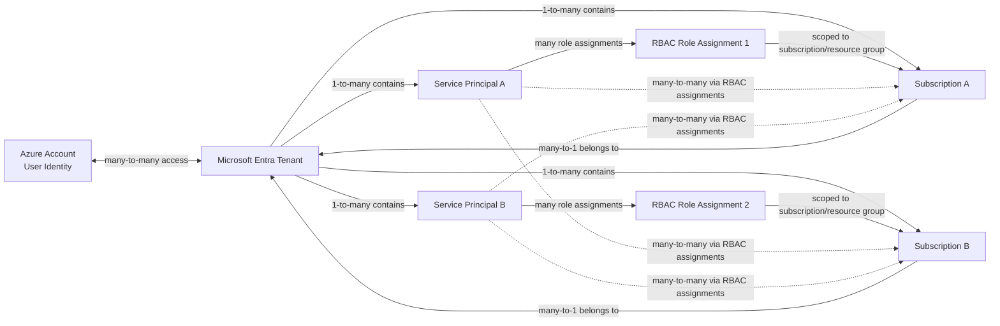

## Azure Terraform Configuration (Pure Terraform)

This project uses **pure Terraform** (no Terragrunt yet).

Start from the `master` branch, then follow this first-time setup once per machine/account.

---

## Recipe 01 - First-time Azure access from this machine

### 1) What to collect from Azure Portal first

Sign in at [https://portal.azure.com](https://portal.azure.com), then gather:

- `Tenant ID`  
  - Portal path: `Microsoft Entra ID` -> `Overview` -> `Tenant ID`
- `Subscription ID`  
  - Portal path: `Subscriptions` -> select your subscription -> `Subscription ID`
- `Subscription Name`  
  - Used for human-readable validation in CLI output
- `Billing scope confirmation` (free account)  
  - Confirm this is the subscription where you want all Terraform resources created

You will create the following from CLI:
- Service Principal (`client_id`, `client_secret`, `tenant_id`)

---

### 2) Local tool prerequisites

Install and verify:

```bash
az version
terraform version
```

If `az` is missing, install Azure CLI from Microsoft docs:  
[https://learn.microsoft.com/cli/azure/install-azure-cli](https://learn.microsoft.com/cli/azure/install-azure-cli)

If `terraform` is missing, install Terraform from HashiCorp docs:  
[https://developer.hashicorp.com/terraform/install](https://developer.hashicorp.com/terraform/install)

---

### 3) Login and select the correct tenant/subscription

```bash
az login
```

If you have multiple tenants:

```bash
az login --tenant <TENANT_ID>
```

List subscriptions:

```bash
az account list --output table
```

Set the active subscription:

```bash
az account set --subscription <SUBSCRIPTION_ID>
```

Validate current context:

```bash
az account show --output table
```

Expected result:
- correct subscription name
- correct subscription ID
- correct tenant ID

---

### 4) Create a Service Principal for Terraform

Create a scoped Service Principal with `Contributor` access on your subscription:

```bash
az ad sp create-for-rbac \
  --name "sp-terraform-local" \
  --role "Contributor" \
  --scopes "/subscriptions/<SUBSCRIPTION_ID>"
```

Save the returned JSON securely (password manager or secure local secret store).  
You need these values:

- `appId` -> Terraform `ARM_CLIENT_ID`
- `password` -> Terraform `ARM_CLIENT_SECRET`
- `tenant` -> Terraform `ARM_TENANT_ID`

Also keep:
- `SUBSCRIPTION_ID` -> Terraform `ARM_SUBSCRIPTION_ID`

---

### 5) Configure local environment variables for Terraform

Add these to your shell profile (`~/.zshrc` for zsh), then reload shell:

```bash
export ARM_CLIENT_ID="<appId>"
export ARM_CLIENT_SECRET="<password>"
export ARM_SUBSCRIPTION_ID="<subscription-id>"
export ARM_TENANT_ID="<tenant-id>"
```

Reload:

```bash
source ~/.zshrc
```

Quick check (do not print secret values on shared terminals):

```bash
echo "$ARM_CLIENT_ID"
echo "$ARM_SUBSCRIPTION_ID"
echo "$ARM_TENANT_ID"
```

---

### 6) Verify Terraform can authenticate to Azure

From repo root:

```bash
terraform init
```

If this repo/module defines Azure resources, run:

```bash
terraform plan
```

If authentication is correct, `plan` should proceed without Azure auth errors.

---

## Security notes (important)

- Do not commit secrets (`client_secret`) to Git.
- Prefer short-lived/local env vars for development.
- For team/shared CI later, switch to OIDC/federated credentials.
- Keep Service Principal scope minimal (subscription or resource-group scoped).

---

## Next step

After this setup is done and validated, proceed to **Recipe 02**: create a Terraform module for Azure budget/cost alerts.

---

## Identity and Subscription Reference

### Entity quick reference

| Entity | What it is | Why needed for this setup | Where to find/create | Terraform/auth mapping |
|---|---|---|---|---|
| Microsoft Entra ID | Azure identity directory boundary | Holds users, apps, service principals, and auth policies | Azure Portal -> Entra ID -> Overview | Source of `tenant_id` |
| Tenant ID | Unique identifier of Entra directory | Required to authenticate against the right directory | Entra ID -> Overview -> Tenant ID | `ARM_TENANT_ID` |
| Subscription ID | Billing/resource boundary for deployments | Terraform deploys resources to this subscription | Subscriptions -> target subscription -> Subscription ID | `ARM_SUBSCRIPTION_ID` |
| Service Principal | Non-human identity for automation | Enables repeatable non-interactive Terraform auth | `az ad sp create-for-rbac` | Gets RBAC assignments and credentials |
| appId | Application ID of Service Principal app | Used as the OAuth client identifier | Output of SP creation command | Same value as `client_id` / `ARM_CLIENT_ID` |
| client_id | OAuth client identifier | Identifies which app requests tokens | From `appId` | `ARM_CLIENT_ID` |
| client_secret | Secret credential for Service Principal | Needed for local non-interactive Terraform auth | Output `password` from SP creation | `ARM_CLIENT_SECRET` (sensitive) |
| tenant_id | Entra tenant in token flow | Ensures token issuer and directory are correct | Entra tenant metadata | `ARM_TENANT_ID` |

### Relationship mapping (cardinality)



How to read:
- `ACCOUNT <-> TENANT` is many-to-many.
- `TENANT -> SUBSCRIPTION` is one-to-many (so `SUBSCRIPTION -> TENANT` is many-to-one).
- `TENANT -> SERVICE_PRINCIPAL` is one-to-many.
- `SERVICE_PRINCIPAL <-> SUBSCRIPTION` is many-to-many via `ROLE_ASSIGNMENT` (RBAC scopes).

- Account -> Tenant: many-to-many (one user account can access multiple tenants, and tenants can have many users/guests).
- Tenant -> Subscription: one-to-many.
- Subscription -> Tenant: many-to-one (each subscription belongs to one tenant at a time).
- Tenant -> Service Principal: one-to-many.
- Service Principal -> Subscription role assignments: many-to-many via RBAC scopes.

### Azure Free Account mapping note

An Azure Free Account typically starts with one initial subscription under your tenant context. Later, you can have multiple subscriptions in the same tenant, and you can also access other tenants. For Terraform, always confirm the active `tenant_id` + `subscription_id` pair before apply.